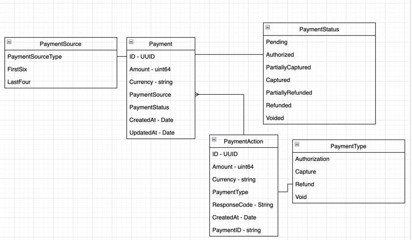

## Data Model

Above lists the currently defined data model for the payments system.

`Payment`
A payment object represents a payment at the current point in time.

* `ID` - unique identifier for the payment 
* `Amount` - Payment amount represented as an integer in minor units
* `Currency` - ISO 4217  currency code
* `PaymentSource` - Reference to the payment card information
  * `PaymentSourceType` - e.g. `Card`
* `PaymentStatus` - Denotes the status of the transaction at this point in time
  * `Pending` - Infers that the payment is in a pending status. It could either be processed and not updated or not executed.
  * `Authorized` - Payment has been authorized for the amount specified in the payment. 
  * `PartiallyCaptured` - The payment has been partially captured for the given amount. i.e. £4 out of a £10 capture.
  * `PartiallyRefunded` - The payment has been partially refunded for the given capture amount. If partially refunded or refunded no further captures can be made.
  * `Refunded` - The payment has been fully refunded. No other payment operations can now be made.
  * `Voided` - The payment has been voided. The whole transaction has been cancelled without billing the customer.  No further action can be made.
* `ActionID` - Links a payment to any action performed against it. 
* `CreatedAt` - Time in which the payment was created.
* `UpdatedAt` - Time in which the payment was updated

`PaymentAction` 
* `ID` - Unique identifier for the action
* `Amount` - amount performed on action in minor units
* `Currency` - ISO 4217  currency code
* `PaymentType` - Type of action made towards payment
  * `Authorization` - Payment has been authorized (should always be present as the first action if a payment is authorized)
  * `Capture` - A capture request was made against the payment
  * `Refund` - A payment was refunded a certain amount
  * `Void` - A payment has been voided.
* `ResponseCode` - `ISO-1987` Response code
* `CreatedAt` - Date in which the action was created.